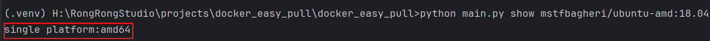
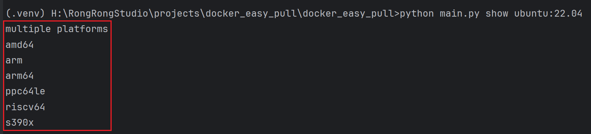
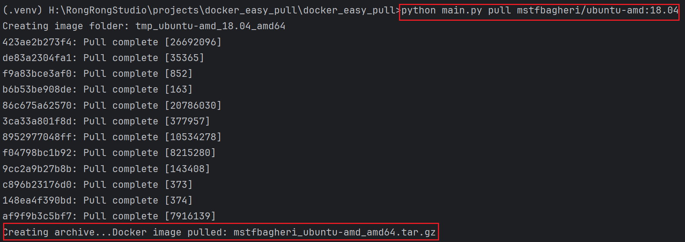
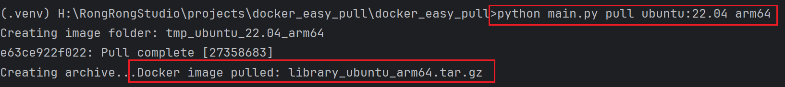

# 1.Introduction

Make DockerHub images easier to pull ! This is a pure Python project.No need to install Docker.This repository features offline downloading of DockerHub images, displaying image information, extracting image names from yaml files, and batch pulling, among other Docker usability features. 

# 2.Install

You should use Python**3.7+**!

**You should use latest version of pip3!**

```bash
pip3 install -r requirements.txt
```

# 3.Use

**Need to use magic！**If you have magic,please ignore!

## 3.1Show DockerHub  Image Architecture

```bash
python3 main.py show dockername
```

- If your image is a single architecture,you will receive a single architecture and architecture name!



- If your image is a multiple architecture,you will receive a multiple architecture and all architecture names!



## 3.2Pull DockerHub Image

- If your image is a single architecture,you will receive a file of tar.gz form.

```bash
python3 main.py pull dockername
```



- If your image is a multiple architecture,you will receive a file of tar.gz form.

```bash
python3 main.py pull dockername architecture_name
```



## 3.3Load DockerHub Image

```bash
docker load -i ***.tar.gz
```

# 4.TODO

- Support show DockerHub  image architecture and next select architecture pull ! More easier !
- Support batch pull ! Like txt or csv.
- Support extracting image names from yaml files ！Like docker compose yaml file !
- Support visual operations ! More easier !
- Support other like dockerhub repository sources ! 
- Support Docker and K8S efficient use of scripts !
- More and More

# 5.Contact me

The author of this repository is RongRongStudio.A.Please contact rongrongstudio@outlook.com and WeChat official account:ArtistcProgramming!

Wechat Group

